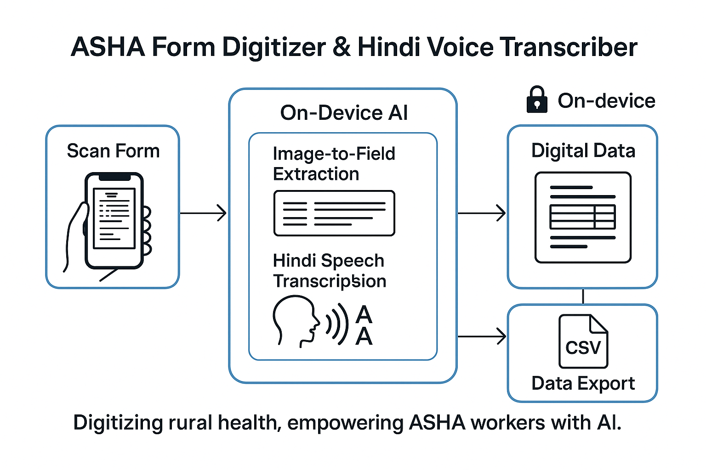

# ASHA - G: On Device Multimodal Digitisation Agent(Gemma 3n Powered)

**Empowering ASHA workers with AI for seamless form digitization and Hindi voice transcription**

[](https://huggingface.co/google/gemma-3n-E4B-it)
[](https://python.org)
[](https://gradio.app)
[](LICENSE)

## 🌟 Project Overview

This project leverages **Google's Gemma 3n 4B model** to create an AI-powered solution that helps [ASHA](https://nhm.gov.in/index1.php?lang=1&level=1&sublinkid=150&lid=226) - **Accredited Social Health Activist** workers in rural India digitize forms and transcribe Hindi voice input. The application  addresses critical challenges in rural healthcare data management by making form processing faster, more accurate, and accessible even for those with limited digital literacy.

## ✨ Highlights & Gemma 3n Capabilities

**This project is a showcase of Gemma 3n's advanced multimodal AI capabilities, designed for real-world social impact:**

1. **Multimodal AI**: Combines vision (image understanding), audio (speech-to-text), and language (text processing) in a single workflow using Gemma 3n 4B.
2. **Vision Intelligence**: Uses Gemma 3n's vision model to detect and extract handwritten form fields from images, enabling digitization of paper forms.
3. **Audio & Speech**: Leverages Gemma 3n's audio pipeline for accurate Hindi voice transcription, converting spoken input to Devanagari script in real time.
4. **Multilingual Support**: Gemma 3n enables robust form field recognition and voice transcription in Hindi and other languages, making the tool accessible to diverse users.
5. **On-Device, Private AI**: All inference runs locally after model download—no internet required, ensuring privacy and accessibility in rural settings.
6. **Real-World Impact**: Directly addresses challenges faced by ASHA workers, healthcare admins, and researchers in rural India.
7. **Scalable, Modular Design**: Built for easy extension and adaptation to new forms, languages, and use cases.

Gemma 3n powers the entire pipeline, from image to structured data, from voice to text, and across languages.**

**🔗 Submission Links:**

- 📄 **Writeup:** [View Writeup](https://www.kaggle.com/competitions/google-gemma-3n-hackathon/writeups/ai-in-rural-india-digitizing-health-records-for-as) 
- 🎥 **Demo Video:** [Watch Video](#) 
- 🚀 **Live Demo:** [Try the Application]([https://huggingface.co/spaces/ParulPandey/demo](https://huggingface.co/spaces/ParulPandey/Smart_Asha_Form))

---
### 🎯 Key Features


- **🔍 Intelligent Form Field Extraction**: Upload photos of forms and automatically extract all field labels using Gemma 3n's vision capabilities
- **🎤 Hindi Voice Transcription**: Fill form fields by speaking in Hindi - the AI provides instant, accurate Devanagari script transcription
- **💻 Fully On-Device Processing**: Runs completely offline once the Gemma 3n model is downloaded - no internet required for inference
- **💾 Smart Caching System**: Reduces processing time by intelligently caching extraction results
- **📊 CSV Export**: All submitted data is automatically saved in structured CSV format for analysis
- **🏗️ Modular Architecture**: Clean, maintainable code with separated concerns for scalability

### 🔧 Usage

### Step-by-Step Workflow

1. **About & Demo Info**: Learn about the application and its impact
2. **Upload Image**: Upload a photo of your handwritten form or try sample images
3. **Extract Fields**: Click "Extract Fields" to automatically detect all form labels
4. **Fill Form**: 
   - Type values directly or
   - Use the microphone icon to speak in Hindi for automatic transcription
5. **Submit**: Save your data to CSV for further processing

### Supported Languages

- **Primary**: Hindi (Devanagari script)
- **Interface**: English and Hindi bilingual support
- **Form Recognition**: Multi-language form field detection


## 📂 Project Structure & File Roles

Here's how the main files and modules work together in the new modular design:

- **main.py**: The main entry point. Launches the Gradio UI and starts the application.
- **ui.py**: Builds the Gradio user interface, manages workflow, and wires up all user interactions and callbacks.
- **ai_processing.py**: Contains core AI logic for image field extraction and Hindi audio transcription using the Gemma model.
- **model_utils.py**: Loads and manages the Gemma 3n model, handles offline mode, and network checks.
- **config.py**: Handles configuration, environment variables, cache loading, and CSV export.
- **samples/**: Contains sample form images for demo/testing.
- **requirements.txt**: Lists all Python dependencies.

**How they interact:**

1. `main.py` launches the Gradio UI via `ui.py`.
2. The UI guides the user through uploading images/audio and filling forms.
3. Image and audio inputs are processed by functions in `ai_processing.py`.
4. Model loading and network logic are handled by `model_utils.py`.
5. Configuration, cache, and CSV export are managed by `config.py`.
6. All results and data are cached for efficiency and saved for future use.

This modular design keeps the codebase clean, maintainable, and easy to extend.


## 📋 Installation & Setup

### Prerequisites

- Python 3.11 or higher
- Hugging Face account and token
1. **Clone the repository**
   ```bash
   git clone https://github.com/parulnith/Gemma-Impact-Challenge

2. **Install dependencies**
   ```bash
   ```bash
   # Create .env file
   echo "HF_TOKEN=your_hugging_face_token_here" > .env
   ```


4. **Run the application**
   ```bash
   python main.py
   ```

5. **Access the interface**
   - Open your browser to `http://localhost:7860`
   - Follow the guided workflow: Upload → Extract → Fill → Submit

### Environment Variables

Create a `.env` file with:
```env
HF_TOKEN=your_hugging_face_token_here
```


